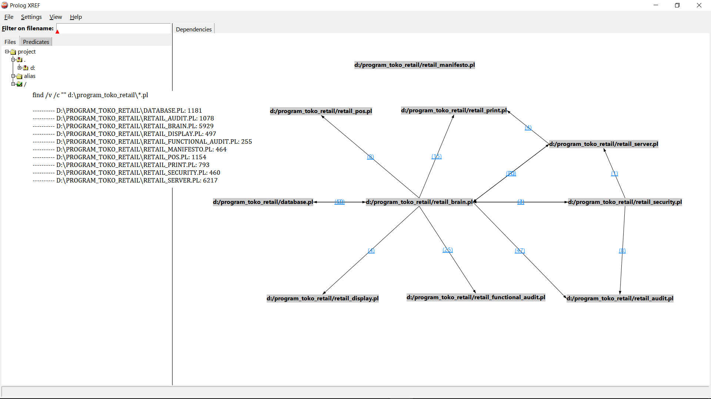

### 🌐 LogicBiz v2.0 - Core Architecture & Self-Auditing Blueprint

Following up on my previous post about **LogicBiz v2.0**, I would like to share a deeper look into the core architecture and the defensive engineering behind this offline-first POS engine. 

The entire ecosystem comprises nearly **18,000 lines of declarative Prolog code** across multiple specialized files. Since the source code remains completely private for commercial and local retail protection, this breakdown explains how the modules interact under the hood without breaking encapsulation.

#### 1. Module Dependency Graph (The XREF Map)
The entire ecosystem is driven by a strict separation of concerns, avoiding monolithic lockups by decoupling the UI, logic, and persistence layers:
* **`retail_server.pl`**: Acts as the main UI controller and the primary handler for the master dashboard web interface (approx. 6,200 lines).
* **`retail_brain.pl`**: Acts as the core logic engine, serving as the central orchestrator that processes all declarative business rules, mathematical constraints, and financial calculations (approx. 5,900 lines).
* **`database.pl`**: The dedicated storage abstraction layer handling secure local SQL encryption and persistence via SQLCipher (approx. 1,100 lines).
* **`retail_pos.pl`**: Manages the high-traffic cashier transaction and checkout input pipelines (approx. 1,100 lines).
* **`retail_audit.pl`**: Houses the automated penetration testing suites to stress-test the runtime boundaries (approx. 1,000 lines).
* **`retail_print.pl`**: Dedicated module for processing and formatting thermal printer receipt outputs (approx. 790 lines).
* **`retail_manifesto.pl`**: The static content engine responsible for serving and rendering the core system manifesto page (approx. 460 lines).
* **`retail_security.pl`**: Serves as the security guard and access control layer, managing user roles, input sanitization, and privilege isolation (approx. 460 lines).
* **`retail_display.pl`**: Drives the customer-facing mall display/TV monitor layout output (approx. 490 lines).
* **`retail_functional_audit.pl`**: Orchestrates the automated core testing execution and outputs localized logs (approx. 250 lines).

---

#### 2. Deep Dive: Embedded Web Application Firewall & Security Guard
To protect local shops from malicious inputs, `retail_security.pl` implements an embedded pattern-matching security guard using Prolog’s native string evaluation. It evaluates raw inputs against known signatures (such as SQL injection, XSS, and remote code execution attempts) with dynamic severity scaling.

Furthermore, this layer introduces an immutable, block-linked ledger structure to guarantee transaction integrity, effectively preventing any fraudulent tampering of historical checkout logs at the local database level. Powered by `library(thread)`, these auditing loops run entirely non-blocking in the background to isolate performance overhead from the fast checkout process.

---

#### 3. Automated Core Testing & Report Compiler (`retail_functional_audit.pl`)
To guarantee that the logic engine remains stable across millions of transactions, the system features an automated, destructive test harness (`retail_functional_audit.pl`). This module orchestrates 15 distinct categories of rigorous checks, ranging from input fuzzing and numeric boundary exploits to `CLP(R)` margin protection bypasses.

Before running heavy stress payloads, the engine performs a complete state backup of the production profile configuration to prevent real-world settings from being corrupted during runtime. The harness directly pipes the testing output into a beautifully structured, localized Markdown report on disk, which yielded the **100% Verified & Operational** benchmark metrics shown in my dashboard.

*(P.S. Please excuse any awkward phrasing in my responses, as I do not speak English fluently and am using an AI assistant to translate my thoughts from Indonesian.)*
