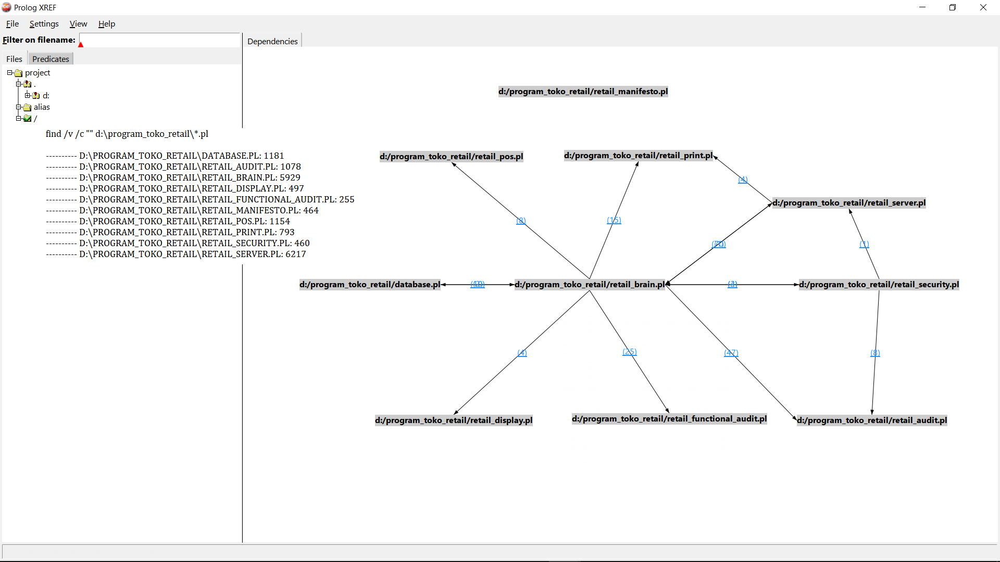

### 🌐 LogicBiz v2.0 - Core Architecture & Self-Auditing Blueprint

Following up on my previous post about **LogicBiz v2.0**, I would like to share a deeper look into the core architecture and the defensive engineering behind this offline-first POS engine. 

The entire ecosystem comprises nearly **18,000 lines of declarative Prolog code** across multiple specialized files. Since the source code remains completely private for commercial and local retail protection, this breakdown explains how the modules interact under the hood without breaking encapsulation.

#### 1. Module Dependency Graph (The XREF Map)
The entire ecosystem is driven by a strict separation of concerns, avoiding monolithic lockups by decoupling the UI, logic, and persistence layers:
* **`retail_server.pl`**: Acts as the main UI controller and the primary handler for the master dashboard web interface (approx. 6,200 lines).
* **`retail_brain.pl`**: Acts as the core logic engine, serving as the central orchestrator that processes all declarative business rules, mathematical constraints, and financial calculations (approx. 5,900 lines).
* **`database.pl`**: The dedicated storage abstraction layer handling secure local SQL encryption and persistence via SQLCipher (approx. 1,100 lines).
* **`retail_pos.pl`**: Manages the high-traffic cashier transaction and checkout input pipelines (approx. 1,100 lines).
* **`retail_audit.pl`**: Houses the automated penetration testing suites to stress-test the runtime boundaries (approx. 1,000 lines).
* **`retail_print.pl`**: Dedicated module for processing and formatting thermal printer receipt outputs (approx. 790 lines).
* **`retail_manifesto.pl`**: The static content engine responsible for serving and rendering the core system manifesto page (approx. 460 lines).
* **`retail_security.pl`**: Serves as the security guard and access control layer, managing user roles, input sanitization, and privilege isolation (approx. 460 lines).
* **`retail_display.pl`**: Drives the customer-facing mall display/TV monitor layout output (approx. 490 lines).
* **`retail_functional_audit.pl`**: Orchestrates the automated core testing execution and outputs localized logs (approx. 250 lines).

---

#### 2. Deep Dive: Embedded Web Application Firewall & Security Guard
To protect local shops from malicious inputs, `retail_security.pl` implements an embedded pattern-matching security guard using Prolog’s native string evaluation. It evaluates raw inputs against known signatures (such as SQL injection, XSS, and remote code execution attempts) with dynamic severity scaling.

Furthermore, this layer introduces an immutable, block-linked ledger structure to guarantee transaction integrity, effectively preventing any fraudulent tampering of historical checkout logs at the local database level. Powered by `library(thread)`, these auditing loops run entirely non-blocking in the background to isolate performance overhead from the fast checkout process.

---

#### 3. Automated Core Testing & Report Compiler (`retail_functional_audit.pl`)
To guarantee that the logic engine remains stable across millions of transactions, the system features an automated, destructive test harness (`retail_functional_audit.pl`). This module orchestrates 15 distinct categories of rigorous checks, ranging from input fuzzing and numeric boundary exploits to `CLP(R)` margin protection bypasses.

Before running heavy stress payloads, the engine performs a complete state backup of the production profile configuration to prevent real-world settings from being corrupted during runtime. The harness directly pipes the testing output into a beautifully structured, localized Markdown report on disk, which yielded the **100% Verified & Operational** benchmark metrics shown in my dashboard.

### 🧠 Core Engine Predicates (`retail_brain.pl`)

This section provides a high-level technical breakdown of the most critical predicates housed within the core orchestration hub, `retail_brain.pl`. These rules manage everything from identity access management to real-time predictive inventory analytics and fraud mitigation loops.

#### 🔵 User & Authentication Layer
- **verifikasi_login_pengguna/4** : Verifies user credentials, handles password hashing checks, and initiates session states.
- **ambil_user_by_username/2**  : Fetches user metadata from the storage using a specific username.
- **update_user/3**              : Updates user profile details or permission levels in the database.
- **nama_lengkap_dari_username/2** : Resolves a unique username into the employee's full display name.
- **daftar_user_untuk_shift/1**  : Retrieves a list of active users assigned to a specific shift.
- **tambah_user_baru/4**         : Internal helper to register a new user with defined access roles.
- **ubah_password_user/3**       : Internal helper to securely update and overwrite a user's password.

#### 🔵 Product Master Data Layer
- **tambah_master_produk/6**     : Inserts a new product into the master catalog with pricing, SKU, and categories.
- **hapus_produk_massal/2**      : Performs bulk deletion or archiving of product lines from the database.
- **gambar_produk/2**            : Associates a specific product SKU with its corresponding image asset path.
- **sinkronisasi_indeks_gambar/0** : Synchronizes the product image registry with physical files on local storage.
- **validasi_aset_produk/0**     : Validates data integrity, checking for missing barcodes, images, or pricing anomalies.
- **ambil_path_gambar/2**        : Retrieves the exact file path of a product image for the front-end display.

#### 🔴 Transaction & Cashier Engine
- **proses_transaksi/8**         : The critical engine rule that processes a sale checkout, handles locks, and calculates final amounts.
- **catat_pembayaran_tx/13**     : Securely logs payment types (cash, debit, QRIS), change given, and tax splits.
- **catat_transaksi_multi_item/3** : Handles batch processing of multiple items contained within a single cart.
- **catat_transaksi_baru/2**     : Initializes a new transaction sequence in the retail journal.
- **buat_id_transaksi_baru/1**   : Generates a unique, sequential, and tamper-proof transaction ID.
- **hitung_total_keranjang/3**   : Iterates through the current shopping cart to compute gross total and items count.
- **ambil_total_transaksi/8**    : Recovers overall sales telemetry data for current active registers.
- **buat_teks_struk_nota_adaptif/3** : Generates dynamically formatted raw receipt text based on character limits of the connected printer.

#### 🔵 Accounting & Finance Layer
- **hitung_keuangan_harian/5**   : Aggregate function calculating total revenue, net margins, and cash-drawer balances for the day.
- **hitung_beban_harian/2**      : Summarizes daily operational expenses (e.g., store maintenance, local utilities).
- **hitung_beban_bulanan/2**     : Summarizes recurring monthly fixed costs and operational overhead.
- **hitung_amortisasi_capex/2**  : Computes depreciation schedules for store hardware and capital assets.
- **hitung_statistik_periode/11**: Generates a comprehensive multidimensional analytics vector for a given date range.
- **rekap_laba_rugi_bulanan/2**  : Outputs a formal profit-and-loss summary report for the active calendar month.
- **rekap_laba_rugi_fleksibel/2** : Generates custom-range profit-and-loss tracking data for ad-hoc audits.

#### 🟣 AI & Intelligence Layer
- **terdeteksi_oleh_ai/2**       : Interfaces with sensor inputs to trigger logical rules based on pattern recognition.
- **terdeteksi_oleh_ai_gender/3** : Evaluates localized customer demographic flows filtered by gender logic patterns.
- **terdeteksi_oleh_ai_jam/3**    : Evaluates traffic density trends across specific hourly operation clusters.
- **buat_analisis_bundling_ai/5** : Runs inductive logic programming or frequent itemset rules to suggest product bundles (A Priori style).
- **out_of_stock_predictive_alarm/3** : Uses historical sales velocity to flag items likely to deplete before the next supply restock.
- **lacak_akar_masalah/3**       : A backward-chaining diagnostic rule to identify the root cause of systemic stock or balance discrepancies.
- **rekomendasi_alokasi_clp/3** : Logic-driven recommendation engine for Customer Loyalty Program point allocations.

#### 🔴 Security & Forensics Layer
- **curang_detector/3**          : Fraud-detection engine that flags anomalous cashier behavior (e.g., frequent voids, sudden price overrides).
- **freeze_transaksi/2**         : Instantly locks a suspicious transaction thread to prevent database mutation during unexpected states.
- **void_transaksi/3**           : Standardized logic to safely invalidate a transaction, logging supervisor authorization and stock reversals.
- **audit_kasir_harian/5**       : Validates physical cash counted vs. system records, flagging overages/shortages.
- **laporan_integritas_harian/1** : Runs a full system self-check to ensure no relational constraints or ledger entry numbers are broken.

#### 🔵 Shift & Scheduling Layer
- **atur_shift_kasir/5**         : Sets up rotation matrices, assign points of sale, and assigns cashiers to distinct time blocks.
- **cek_shift_aktif/2**          : Determines current system access window constraints based on the logged-in staff's scheduled shift.
- **generate_jadwal_otomatis/2** : Auto-allocates optimal staff shifts based on past peak sales hours and employee availability rules.
- **rekap_kinerja_kasir/7**      : Aggregates cashier performance KPIs (average checkout speed, transaction volumes, void ratios).

#### 🔵 Utility & Database Layer
- **data_penjualan_periode_paginated/8** : Server-side paginated queries to pull indexed sales history cleanly without locking up RAM.
- **ambil_operator_transaksi/2** : Fetches operator metadata bound to a past finalized transaction record.
- **evaluasi_input_scanner/2**   : Sanitizes, parses, and decodes incoming hardware barcode/RFID scanner inputs into product lookups.
- **validasi_lisensi_aktif/1**   : Verifies cryptography tokens ensuring the offline-first application lease is authentic and valid.
- **generate_shutdown_token/3**  : Generates temporary tokens required for safe, graceful database detachments and end-of-day device shutdowns.

*(P.S. Please excuse any awkward phrasing in my responses, as I do not speak English fluently and am using an AI assistant to translate my thoughts from Indonesian.)*
