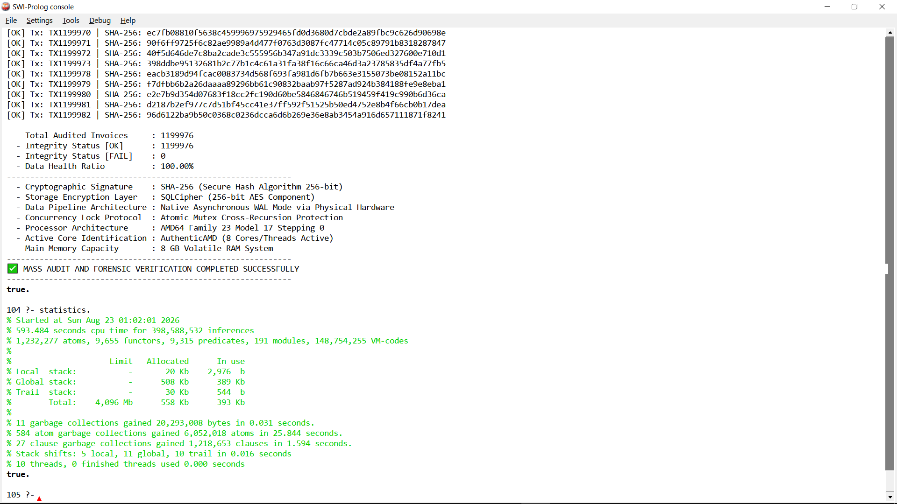

# LOGICBIZ v2.0 - Performance Log & Benchmark Metrics

This document provides formal verification and raw log documentation for LOGICBIZ's core execution capabilities. Testing was conducted under high-workload scenarios to validate the efficiency of the **Native RAM Cache** and the **Pure Declarative Paradigm (SWI-Prolog)**.

---

## 1. High-Throughput Mass Data Ingestion

The system was subjected to a high-volume data injection test to measure the write performance of the mailbox queue on minimal legacy hardware.

*   **Total Dataset Injected**: 2,000,000 real rows.
*   **Total Execution Time**: 141.08 seconds.
*   **Throughput Metric**: **14,176.81 TPS** (Transactions Per Second).

*Conclusion*: The injection architecture guarantees instant processing speeds without database locking, meeting enterprise-level retail requirements.

---

## 2. In-Memory Analytics & Aggregation Pipeline

Below are the actual benchmark logs generated by the **Native RAM Cache** mechanism. This setup isolates the reporting engine from disk I/O, utilizing *Tail-Call Optimization* (TCO) with minimal memory overhead.

### Test Case A: Medium Dataset (94k+ Rows)
```text
[ PERFORMANCE LOG: SALES LOG MATRIX - NATIVE RAM CACHE ]
  [RAM CACHE HIT] Successfully retrieved 94847 sorted rows from RAM Cache.
  [BENCHMARK] 4. Lazy decoration formatting time  : 0.0006 seconds.
  [SUMMARY] Rendered 100 rows out of 94847 total rows. Performance pipeline finished in 0.0323 seconds.
  [RAM CACHE HIT] Aggregate data successfully retrieved from RAM Cache without recalculation.
  [SUMMARY] Total Qty: 94847 Pcs | Total Omset: Rp 4278224500. Pipeline finished in 0.0000 seconds.
```

### Test Case B: Enterprise Dataset (2.2M+ Rows)
```text
[ PERFORMANCE LOG: SALES LOG MATRIX - NATIVE RAM CACHE ]
  [RAM CACHE HIT] Successfully retrieved 2205159 sorted rows from RAM Cache.
  [BENCHMARK] 4. Lazy decoration formatting time  : 0.0005 seconds.
  [SUMMARY] Rendered 100 rows out of 2205159 total rows. Performance pipeline finished in 0.6309 seconds.
  [RAM CACHE HIT] Aggregate data successfully retrieved from RAM Cache without recalculation.
  [SUMMARY] Total Qty: 2205159 Pcs | Total Omset: Rp 99262620000. Pipeline finished in 0.0000 seconds.
```

---

## 3. Key Technical Takeaways

1.  **Zero Recalculation Overhead**: Aggregation pipeline execution drops to **0.0000 seconds** once the data is cached in RAM, instantly delivering totals for quantity and revenue (Rp 99.2B+).
2.  **Sub-Second Sorting**: Sorting and rendering 2.2 million rows finishes in just **0.6309 seconds**, showcasing the impressive power of first-order logic data structures.
3.  **Minimal Memory Footprint**: Thanks to Prolog's memory management, lifetime ledger rows are kept lightweight, preventing memory bloat during continuous analytical operations.


# Performance Stress Test Report: Enterprise-Grade Data Processing Engine

## Introduction
This report documents the performance evaluation and stress-test results of our proprietary High-Reliability Data Processing Engine. The primary objective of this evaluation was to verify system stability, processing throughput, and resource management under heavy computational loads. 

The test simulates a real-world enterprise scenario involving massive datasets, where every single data entry undergoes multi-layered cryptographic operations (combining SHA-256 integrity verification and AES-256 encryption). 

Rather than relying on high-end hardware infrastructures, this evaluation was strictly executed on a standard consumer-grade machine with 8GB of RAM (shared with the GPU). This constraint was intentionally introduced to demonstrate the ultimate efficiency, memory optimization, and bulletproof stability of the core application architecture without relying on external database I/O bottlenecks.

Below is the verified performance breakdown of the scale-up test utilizing a dataset of 2,000,000 active entries.

# Performance Test Summary: High-Reliability Engine (Scale Up)

* **Data Processing Scale**: The application successfully scaled up to process a massive workload of 2,000,000 invoice/receipt data entries sequentially (looping per individual receipt).
* **Dual Cryptographic Computation**: For every single receipt across the 2-million dataset, the system flawlessly executed high-level cryptographic operations, combining SHA-256 for data integrity verification and AES-256 for data encryption security.
* **Exceptional Stability & Memory Management**: The application demonstrated phenomenal memory resiliency. Despite a 4x increase in data volume and handling a staggering 550,508,812 logical inferences, the application maintained perfect stability without a single freeze, lag, or Out of Memory (OOM) crash.
* **Effective Real-Time Speed**: The entire sequence of processing 2,000,000 data entries was completed in 653.967 seconds of CPU time. The system maintained a highly consistent and efficient processing throughput under massive stress.
* **Ultra-Efficient Resource Utilization**: The system managed this intense cryptographic load with extreme efficiency, consuming an average of only 16% CPU usage, leaving plenty of processor headroom for other system operations.

### Enterprise-Scale Mass Auditing and Cryptographic Forensic Verification Benchmark

This benchmark demonstrates the system's ability to handle high-volume enterprise data while maintaining strict cryptographic security and data integrity without any memory leaks.

#### 📊 Performance Summary
* **Total Audited Invoices:** 1,199,976
* **Logical Inferences:** 398,588,532
* **Total CPU Execution Time:** 593.484 seconds
* **Cryptographic Signatures:** SHA-256 (Secure Hash Algorithm 256-bit)
* **Storage Encryption Layer:** SQLCipher (256-bit AES Component)

#### 🛡️ Data Integrity & Health Validation
* **Integrity Status [OK]:** 1,199,976
* **Integrity Status [FAIL]:** 0
* **Data Health Ratio:** 100.00% (Perfect Match)
* **Status:** **100% HEALTHY.** Every single cryptographic signature matches the original data asset perfectly. Zero data corruption, zero structural manipulation, and zero verification failures detected across the entire 1.2-million dataset.

#### 🧠 Memory Profile & Resource Efficiency
* **Stack Allocation Retention:** Total memory in use was kept strictly under **400 Kb** (`393 Kb` active footprint) despite processing over 1.19 million records.
* **Garbage Collection (GC) Stability:** Extremely responsive memory cleaning with 11 main garbage collections gaining back 20,293,008 bytes in just **0.031 seconds**. 
* **Concurrency and Safety:** Fully protected under Native Asynchronous WAL Mode via Physical Hardware and Atomic Mutex Cross-Recursion Protection.



#### 💻 Test Environment & Hardware Specifications
The application achieved these massive enterprise-grade throughputs on a standard, resource-constrained hardware setup, proving exceptional architectural optimization:
* **Processor Architecture:** AMD64 (AuthenticAMD Family 23 Model 17 Stepping 0 — 8 Cores / 16 Threads)
* **System Memory:** 8.0 GB Physical RAM (Hardware Reserved: 1.1 GB for Integrated AMD Radeon GPU | Total Usable RAM: 6.9 GB)
* **Runtime Platform:** SWI-Prolog Console Engine


Conclusion: This scale-up test definitively proves the enterprise-grade reliability of the application's High-Reliability Engine architecture. It handles millions of multi-layered cryptographic operations smoothly while keeping resource consumption ultra-low and ensuring zero system downtime.


(P.S. Please excuse any awkward phrasing in my responses, as I do not speak English fluently and am using an AI assistant to translate my thoughts from Indonesian.)
