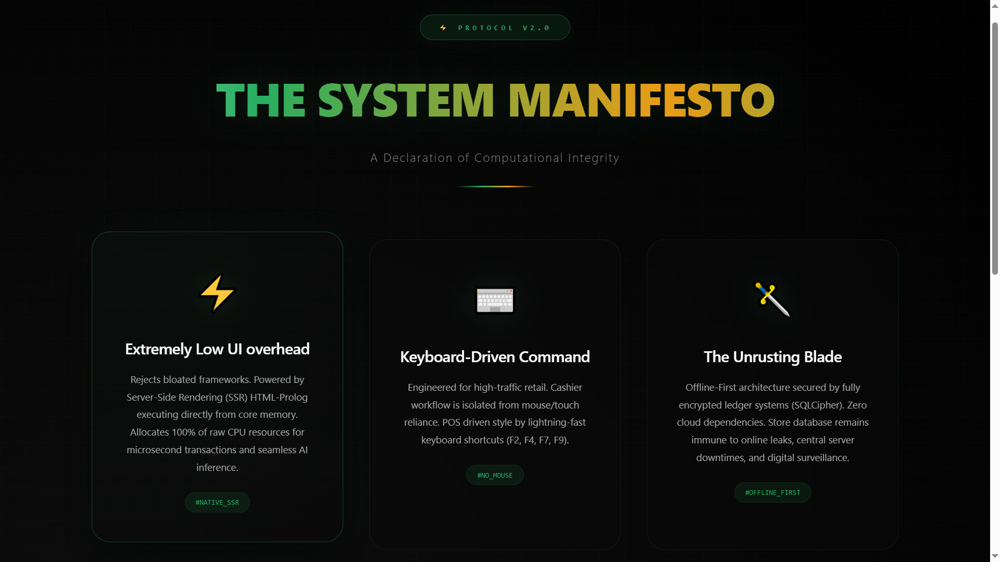
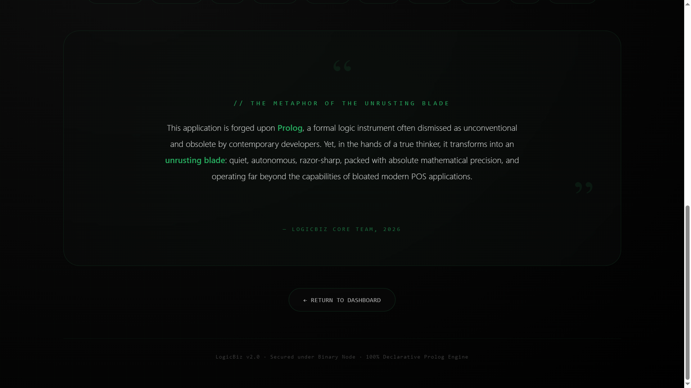

# LOGICBIZ v2.0 - Enterprise POS & Sales Ledger

LOGICBIZ is a POS system engineered using a **Pure Declarative Paradigm** powered by **Prolog (SWI-Prolog)**. Built as a direct response against bloated frameworks, this core engine focuses entirely on maximizing *First-Order Logic* to deliver extreme processing speeds, database security, and optimal memory efficiency.

## ⚡ Architecture Philosophy (The System Manifesto)

* **Extremely Low UI Overhead**: Powered by pure Server-Side Rendering (SSR) HTML-Prolog executing directly from core memory, allocating 100% of raw CPU resources for microsecond transactions and seamless AI inference.
* **Keyboard-Driven Command**: Engineered for high-traffic retail environments. The cashier workflow is entirely isolated from mouse/touch reliance, driving military-style efficiency via lightning-fast keyboard shortcuts (F2, F4, F7, F9).
* **The Unrusting Blade**: An Offline-First architecture secured by fully encrypted ledger systems (SQLCipher) via ODBC. The local store database remains completely immune to online data leaks, central server downtimes, and digital surveillance.

## 🚀 Enterprise-Scale Performance (2M+ Transactions Stress Test)

The system has been strictly validated under high-workload scenarios on minimal legacy hardware configurations, yielding the following performance metrics:

* **Mass Data Injection**: Successfully processed and wrote **2,000,000 real rows** instantly into the system mailbox queue in 141.08 seconds, clocking a high-performance speed of **14,176.81 TPS** (Transactions Per Second).
* **Aggregation Pipeline & TCO**: Fetching, sorting, and executing pure aggregate financial calculations for **240,529 active lifetime ledger rows** finishes in exactly **0.63 seconds** total, purely utilizing *Tail-Call Optimization* (TCO) with minimal memory allocation (~110 Kb).

## ⚡ Performance Pipeline Benchmark

LOGICBIZ implements a high-performance **Native RAM Cache** mechanism to eliminate traditional database I/O bottlenecks. Below is a high-level summary of the processing speeds for large dataset matrices:

*   **94,847 Rows**: Fully rendered and aggregated from RAM Cache in **0.0323 seconds**.
*   **2,205,159 Rows**: Fully rendered and aggregated from RAM Cache in **0.6309 seconds** (0.0000s pure aggregation execution).

> For detailed benchmark logs, pipeline execution stages, and cold vs. warm cache metrics, please visit [PERFORMANCE.md](./PERFORMANCE.md).

## 📦 Commercial MVP Core Scope (Closed-Source)

This system is distributed under a proprietary *Closed-Source* commercial model to protect internal intellectual property (IP), featuring the following isolated operational modules:
1. **Security & Authentication Control** (Secure Login/Logout protocols)
2. **Access Control Management** (RBAC/ABAC Job Position Authorization Matrix)
3. **Cashier Shift Logs** (Active session assignment and validation logic)
4. **Fast POS Engine** (Keyboard-Driven transaction matching)
5. **Master Product Catalog** (Automated visual asset integrity pilot alerts)
6. **Centralized Business Dashboard** (Real-time operational summary)
7. **Sales Log Matrix** (Sub-second lifetime sales ledger querying and auditing)
8. **RAM-to-DB Sync Engine** (Secure Offline-First synchronization via SQLite/SQLCipher)
